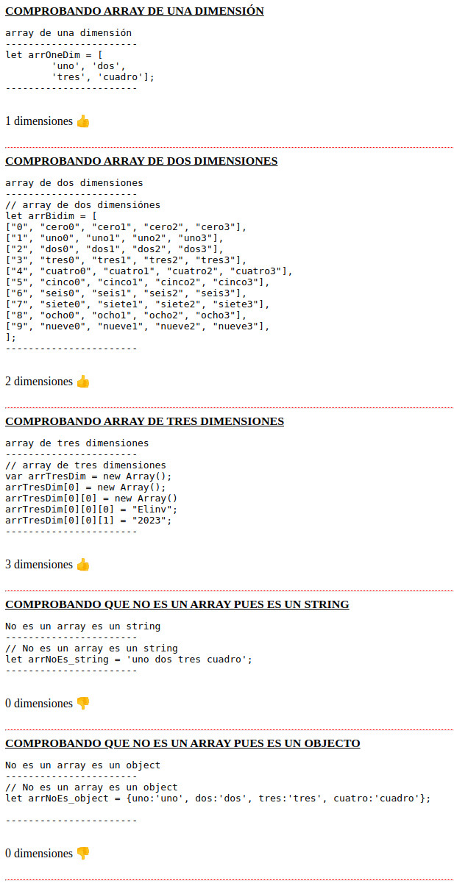

  

<h1 align="center">Get dimensions and instanceof array in javascript</h1>

---
- Obtener dimensiones e instancias de matriz en javascript
---
- Así se verá el resultado en la pagina web

  

---

- Cualquier duda que tengan la dirigen a elinv.elinv@gmail.com.

-  🛠️ Errores, sugerencias, ideas, envialas a nuestro mail: <elinv.elinv@gmail.com>

- Ver info de Elinv en Google Search:  
<a href="https://www.google.com.ar/search?q=elinv">
   Enlace a la info de Elinv  -> en Google Search
</a>

- 👍 Saludos!

- Atte.

# Elinv.